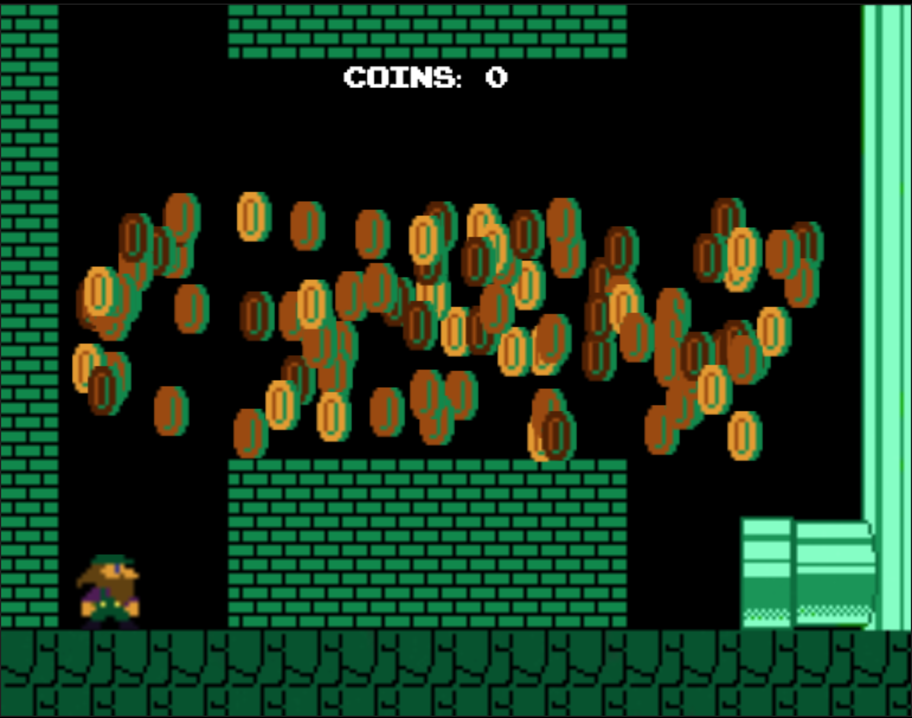

## Super Jeff

[play Super Jeff](http://willbetts.tech/Super-Jeff/)

### Storyline

Jeff is a descendent of Mario and is stuck in a NYC sewer where coins are appearing randomly.  
Jeff is doing what he can to pass the time before he finds a way out.  

Super Jeff is a game inspired by super mario.  It was developed using JavaScript and uses
DOM manipulation and HTML5 Canvas for smooth 2D rendering.  



### How To Play

Try to collect as many coins before time runs out.  Use the arrow keys to move around and jump.  Help Jeff get Rich!

#### Rendering & Sprites
Rendering is done using HTML 5 Canvas. By covering sprite images over Canvas elements, I was able to use simple math to detect collisions.

```javascript
drawEntity: function (entity, ctx) {
  ctx.drawImage(entity.sprite.img,
                entity.sprite.srcX, entity.sprite.srcY,
                entity.sprite.srcW, entity.sprite.srcH,
                entity.x, entity.y,
                entity.w, entity.h);
}
```

### State Machine

A state machine was implemented that accounts for the logic of which direction Jeff is facing, walking, or jumping.

```javascript
this.states = {
  jumping: {
    movement: function (data) {
      if (self.velY === 0) {
        const jumpSound = self.jumpSound.cloneNode();
        jumpSound.play();
        self.velY -= 23;
      }
    },

    animation: function (data) {
      if (self.direction === "right"){
          self.sprite = self.spriteAnimations.jumpRight;
      } else {
        self.sprite = self.spriteAnimations.jumpLeft;
      }
    }
  },
  walking: {
    movement: function (data) {
      if (self.direction === "right") {
          self.x += self.velX;
      } else {
        self.x -= self.velX;
      }
    },

    animation: function (data) {
      if (self.direction === "right") {
        if (data.animationFrame % 5 === 0) {
            self.sprite = self.spriteAnimations.walkRight.frames[self.spriteAnimations.walkRight.currentFrame];
            self.spriteAnimations.walkRight.currentFrame++;

            if (self.spriteAnimations.walkRight.currentFrame > 2) {
                self.spriteAnimations.walkRight.currentFrame = 0;
              }
        }
      } else {
        if (data.animationFrame % 5 === 0) {
            self.sprite = self.spriteAnimations.walkLeft.frames[self.spriteAnimations.walkLeft.currentFrame];
            self.spriteAnimations.walkLeft.currentFrame++;

            if (self.spriteAnimations.walkLeft.currentFrame > 2) {
                self.spriteAnimations.walkLeft.currentFrame = 0;
              }
        }
      }
    }
  },
  standing: {
    movement: function (data) {
      return;
    },

    animation: function (data) {
      if (self.direction === "right"){
          self.sprite = self.spriteAnimations.standRight;
      } else {
        self.sprite = self.spriteAnimations.standLeft;
      }
    }
  }
};
this.currentState = self.states.standing;
this.direction ="right";
this.velY = 0;
this.velX = 3.8;
this.coins = 0;
this.x = x;
this.y = y;
this.w = w;
this.h = h;
},
```
